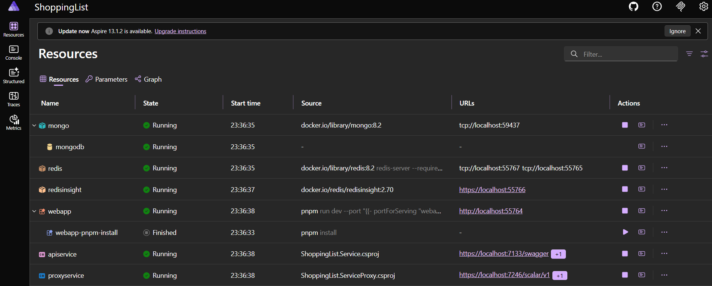
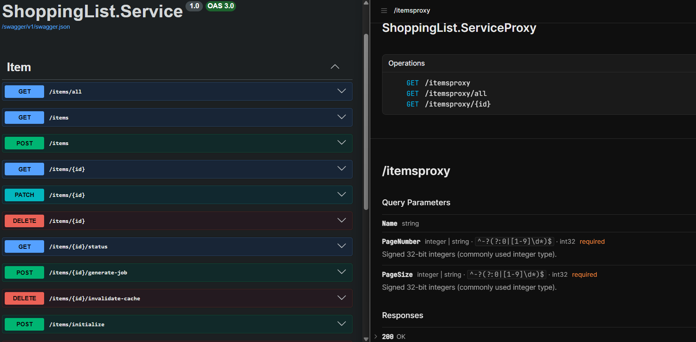
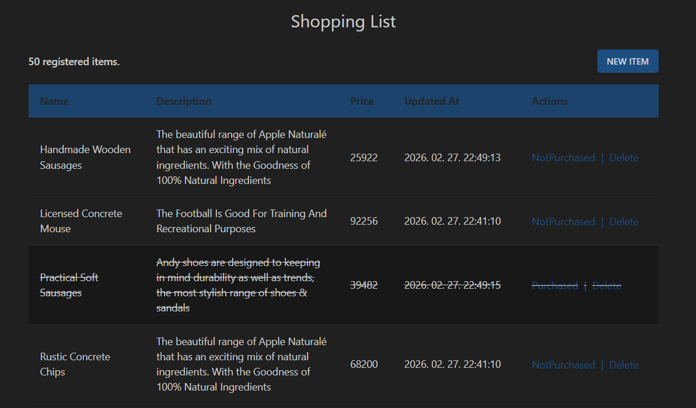
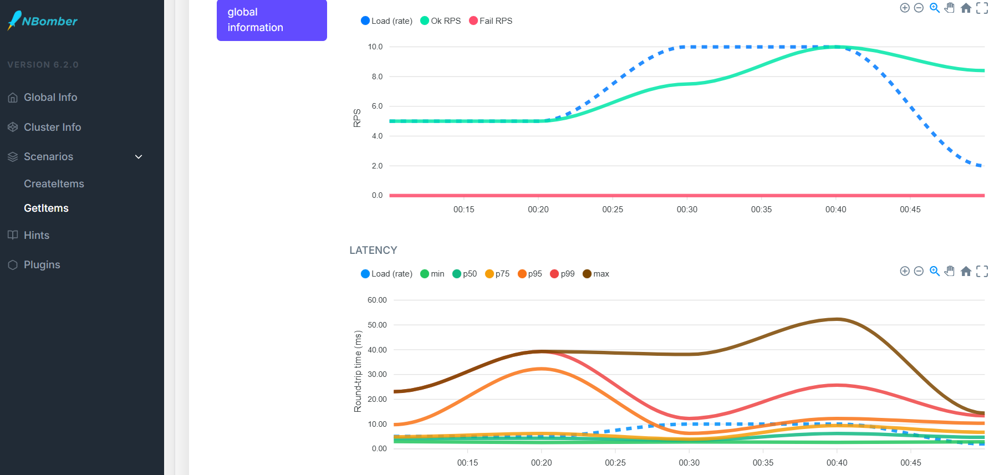

## ShoppingList in Aspire
This full-stack application was created for learning.

### Project Requirements:
- .net10 SDK
- docker (for Aspire)
- pnpm (for Nuxt)

### Run commands
After running these commands you can reach the Aspire dashboard.
```bash
cd ./ShoppingList.AppHost
dotnet run
```

### NBomber helper
You can try out api service, redis and fill the db in one go with these commands (Aspire is up already)
```bash
cd ./ShoppingList.ServiceBomber
docker-compose up # optional, comment out timescaledb lines
dotnet run
```

### Components
#### Aspire AppHost orchestration
- MongoDb
- RedisCache
- ApiService
- ProxyService
- ClientApp



#### 3-layer api service

- Core layer:
  - Entities, Dtos, RepositoryContract

- Infrastructure layer:
  - MongoRepository

- Service layer:
  - Webapi with Swagger
  - Hybrid caching
  - Sync and async api endpoints
  - Both for json and xml

#### Reverse proxy
- Resilient proxy for WebApi
- Using Scalar and NSwag client
- MinimalAPI with Vertical slice architecture



#### ShoppingList frontend up
- Nuxt (Vue.js) app
- TailwindCSS 4 with daisyUI



#### NBomber console app
- testing api endpoints with data load
- checking results in TimeScaleDb (optional docker-compose)

